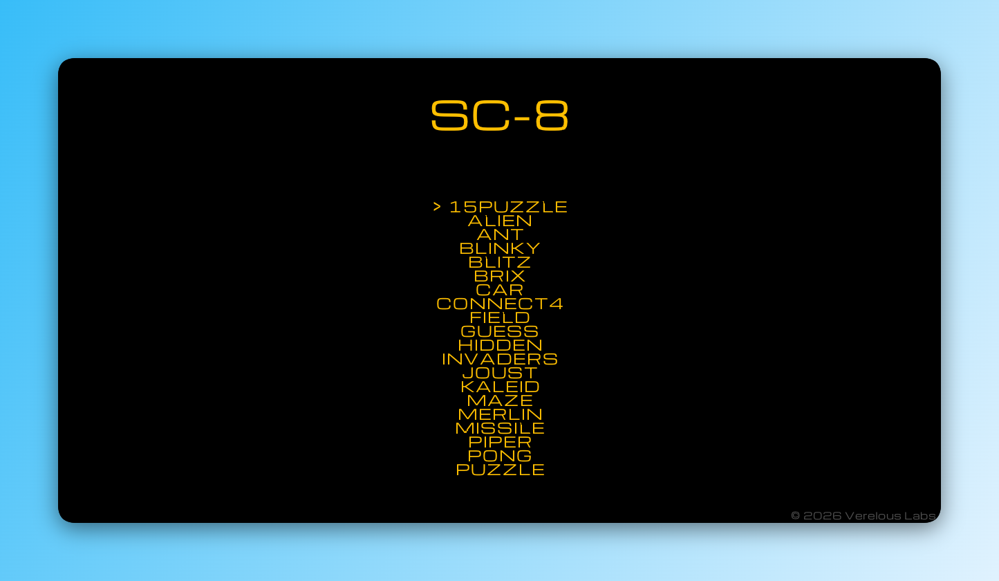
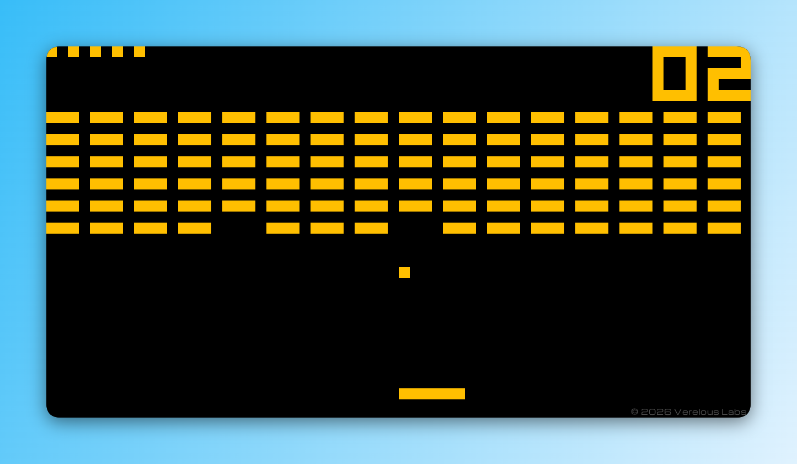
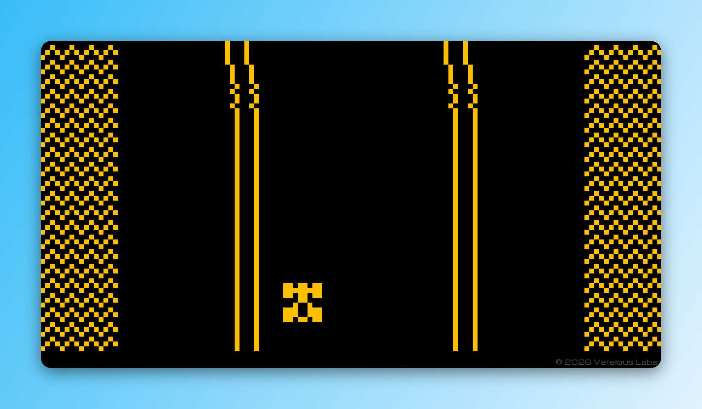

# Skate


A SUPER-CHIP emulator.

## Overview
Skate is a Modern SUPER-CHIP emulator written in C, with backward compatability for CHIP-8 games. It comes loaded with 30+ ROMs, including 8 for testing.

## Preview




## Features
- Accurate CHIP-8 and Modern SUPER-CHIP emulation
- Sound support
- Automatic ROM discovery
- Built-in ROM browser
- Seamless ROM switching
- Compatibility test ROMs included
- Modern retro-inspired interface
- Over 30 bundled ROMs, including 8 compatibility test ROMs

## Built With
- [C](https://www.c-language.org/) - Core programming language.
- [raylib](https://www.raylib.com/) - Graphical user interface framework.
- [GCC](https://gcc.gnu.org/) - Compiler toolchain.

## Getting Started

### Prerequisites

#### For Developers
Ensure you have GCC installed on your machine:
```bash
gcc --version
```
Install raylib for the display engine:
##### Using Scoop (recommended)
```bash
scoop install raylib
```

### Installation

#### For Players
Download the latest release archive from the [Releases](../../releases) page.
Extract the archive and run `Skate.exe`. Ensure the `assets` and `roms` folders remain in the same directory as the executable.

#### For Developers
Clone this repository to your local machine:
   ```bash
   git clone https://github.com/9mus/skate.git
   cd skate
   make
   ```

## Acknowledgements
- [Timendus' CHIP-8 Test Suite](https://github.com/Timendus/chip8-test-suite) for the compatibility test ROMs used for identifying subtle implementation bugs and ensuring accurate Modern SUPER-CHIP emulation.
- [Gulrak's CHIP-8 Documentation](https://chip8kb.gulrak.net/) for the comprehensive knowledge of the CHIP-8 and its variants.

## Authors
Developed by [9musa](https://github.com/9musa) under Verelous Labs.

## License
This project is licensed under the MIT License - see the [LICENSE](LICENSE) file for details.